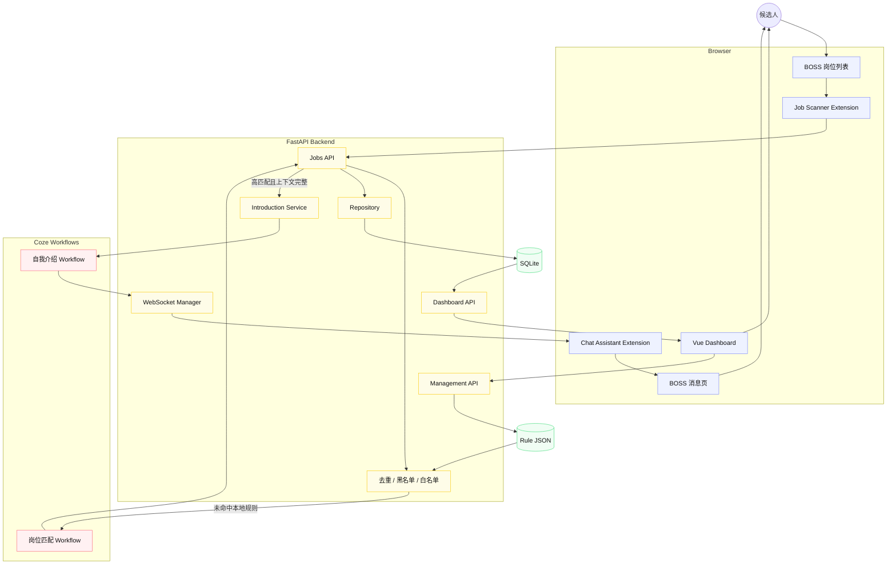

# 🤖 BOSS AI 求职助手

> 集成 Chrome Extension、Coze Workflow、FastAPI、WebSocket 与 Vue 3 的本地求职辅助系统

BOSS AI 求职助手是一个围绕真实求职流程设计的个人全栈项目。系统从 BOSS 岗位列表采集职位信息，先执行本地黑白名单规则，再对未命中规则的岗位调用 AI Workflow 完成匹配分析，将结果保存到本地数据库，并通过可视化看板管理求职进度；当岗位匹配度达到动态阈值时，还可以异步生成针对岗位的自我介绍并回填到对应聊天窗口。

相比只输出一次分析结果的 AI Demo，这个项目更强调完整链路落地：从 **浏览器 DOM 采集、岗位匹配、数据持久化、进度管理，到异步生成、WebSocket 推送与消息回填**，将 AI 能力组织成一个可操作、可追踪、可测试的产品原型。


## 📝 最近更新

<details>
<summary><strong>查看版本更新记录（最新：2026-08-20）</strong></summary>

- `2026-08-20`
  - 规则管理页：完成 `/management` 可视化配置，支持动态匹配阈值、黑白名单查看、新增、编辑、删除、独立启停和本地规则测试。
  - 规则持久化：新增统一规则服务和管理 API，配置经 Pydantic 校验后使用临时文件原子替换，保存后立即刷新缓存，无需重启 FastAPI。
  - 评估链路：普通岗位调整为“黑名单 → 白名单 → Coze → 动态阈值”，插件改为遵循后端 `should_contact` 决策，不再自行硬编码匹配阈值。
  - 岗位分析：新增 `/analysis` 页面和聚合 API，支持日期、类别、匹配度、投递状态筛选，以及分数、类别、技能、要求、优势和缺口统计。
  - 规则配置：黑名单与白名单增加文件状态缓存，配置未变化时不重复读取，配置损坏时继续使用上一份有效缓存。
  - 岗位筛选：新增招聘者活跃度判断，明确超过 3 天的岗位在调用后端前直接跳过。
  - 连接控制：消息回填扩展新增 WebSocket 连接开关，连接与自动发送均保持默认关闭。
  - 项目文档：补充公开仓库说明、隐私边界、测试结果和面向招聘方的项目介绍。
- `2026-08-19`
  - 管理面板：新增 Vue 3 岗位总览和详情页，支持分页、筛选、搜索、分析结果展示与求职状态更新。
  - 批量模式：新增受本地白名单约束的批量评估入口，同时保留岗位去重和黑名单检查。
  - 自我介绍链路：新增后台异步生成、WebSocket pending 队列、ACK 确认和聊天页回填流程。
  - 项目初始化：完成岗位筛选扩展、FastAPI 服务、Coze 岗位匹配和 SQLite 持久化主链路。

</details>

> **使用边界**：本项目定位为 AI 辅助求职工具，用于岗位信息整理、职位分析、简历匹配和沟通内容辅助生成。项目不会绕过目标平台的访问控制、验证码、安全策略或其他技术保护措施，不提供规避平台规则的功能。涉及招聘平台交互的功能均应遵循平台相关服务协议和使用规范。

---

## ✨ 项目亮点

- 🧩 **完整业务闭环**：覆盖岗位采集、AI 匹配、持久化、看板管理、自我介绍生成和聊天回填，不是单接口 Demo
- 🧠 **双 Workflow 协作**：岗位匹配与自我介绍分别使用独立 Workflow，可单独配置超时和降级策略
- 🧭 **浏览器状态机**：岗位扫描采用串行状态机，支持开始、暂停、停止、恢复、去重和可中断等待
- 🛡️ **安全默认值**：批量模式、WebSocket 连接和自动发送默认关闭；无法唯一定位招聘者时主动停止
- 🔍 **动态 DOM 适配**：集中管理多候选 selector，结合 MutationObserver、文本 fallback 和调试接口应对 SPA 页面变化
- ⚙️ **分层后端设计**：FastAPI 路由、Pydantic Schema、Service、Repository 和 SQLAlchemy Model 分层组织
- 💾 **结构化数据建模**：拆分岗位、标签、评估、要求、申请和沟通记录，保留完整 AI 输出以便追溯
- 🔁 **异步可靠推送**：自我介绍生成不阻塞岗位评估响应，WebSocket 任务收到 ACK 后才从 pending 队列移除
- 📊 **求职进度看板**：支持岗位分页、状态/分数筛选、关键词搜索、详情查看和进度更新
- 📈 **真实数据分析**：基于 SQLite 中每个岗位的最新评估，聚合匹配度、岗位类别、技能需求、核心要求和技能缺口
- ⚙️ **规则可视化管理**：动态维护匹配阈值与黑白名单，支持规则测试、安全落盘和配置热更新
- 🧪 **自动化验证**：当前共 105 项测试通过，覆盖后端分析、规则管理、扩展后台、边界规则和连接恢复；前端生产构建通过

---

## 🏗️ 技术架构

### 技术栈

- 岗位筛选扩展：Chrome Manifest V3 + JavaScript
- 消息回填扩展：Chrome Manifest V3 + WebSocket + Chrome Storage
- 后端：Python + FastAPI + Pydantic + HTTPX
- 数据层：SQLAlchemy + SQLite
- 管理端：Vue 3 + TypeScript + Vite + Element Plus + Axios
- AI 能力：Coze Workflow
- 测试：Pytest + Node Test Runner + Vue TSC

### 核心架构分层

| 层级 | 关键目录 | 职责 |
| :--- | :--- | :--- |
| 岗位采集层 | `job-scanner-extension/` | DOM 采集、招聘者活跃度过滤、任务状态机、沟通流程 |
| 消息回填层 | `chat-assistant-extension/` | WebSocket 连接、联系人定位、草稿回填和发送前复核 |
| 接口层 | `backend/app/api/` | 岗位评估、管理面板、岗位分析、自我介绍和测试推送接口 |
| 服务层 | `backend/app/services/` | Coze 调用、业务编排、规则检查、后台任务和连接管理 |
| 数据层 | `backend/app/database/` | SQLAlchemy Model、Repository、事务保存与查询 |
| Schema 层 | `backend/app/schemas/` | 请求、响应和任务消息的数据校验 |
| 管理端 | `frontend/src/` | 岗位列表、详情、分析展示、状态维护和规则配置 |
| Workflow 层 | `coze/` | 岗位匹配和自我介绍生成的参考 Workflow |

### 系统数据流



数据流路径：扩展采集岗位 → 后端执行去重、黑名单和白名单检查 → 未命中规则时由 Coze 返回结构化匹配结果 → 按动态阈值形成后端决策 → SQLAlchemy 事务化保存 → Vue 看板展示；管理页通过 Management API 原子保存规则并让后续岗位立即读取；高匹配岗位在原评估响应完成后异步生成自我介绍 → WebSocket 推送 → 聊天扩展定位联系人并回填 → 用户检查后发送。

### 数据存储与消息状态分工

项目将长期业务数据、浏览器任务状态和短期推送消息分开处理：

- **SQLite：保存长期业务数据**
  - 保存岗位、技能标签、AI 评估、岗位要求、申请状态和首次沟通记录；
  - `job_id` 唯一约束用于避免同一岗位被重复分析；
  - AI 原始输出与结构化结果同时保留，便于后续排查和展示；
  - 当前使用 SQLite 降低本地部署成本，`DATABASE_URL` 可替换为其他数据库连接。

- **Chrome Storage：保存扩展本地状态**
  - 保存处理过的岗位 ID、扫描计数、连接开关和自动发送开关；
  - 扩展重载后仍可恢复用户选择，避免重复处理；
  - 用户可以通过扩展弹窗清除当前任务进度。

- **WebSocket pending 队列：保存短期推送任务**
  - 自我介绍生成完成后先进入后端内存队列；
  - 插件未连接时保留任务，连接恢复后重新推送；
  - 收到任务 ACK 后删除，服务重启会清空该内存队列。

简言之：**SQLite 存业务历史，Chrome Storage 存浏览器任务状态，pending 队列存尚未确认的实时消息。**

---

## 📁 项目结构

```text
boss-auto-assistant/
├── backend/
│   ├── app/
│   │   ├── api/                     # FastAPI 路由
│   │   │   ├── jobs.py              # 单岗位与批量评估
│   │   │   ├── dashboard.py         # 看板查询与状态更新
│   │   │   ├── analysis.py          # 岗位分析聚合接口
│   │   │   ├── management.py        # 规则配置管理接口
│   │   │   ├── introductions.py     # 自我介绍异步生成
│   │   │   └── chat_assistant.py    # 测试推送与 WebSocket
│   │   ├── core/config.py           # 环境变量和全局配置
│   │   ├── database/
│   │   │   ├── models.py            # SQLAlchemy 数据模型
│   │   │   ├── repositories.py      # 岗位数据写入
│   │   │   ├── dashboard_repository.py # 看板查询
│   │   │   └── analysis_repository.py  # 分析页只读筛选查询
│   │   ├── schemas/                 # Pydantic 请求、响应和规则配置模型
│   │   ├── services/
│   │   │   ├── job_service.py       # 岗位评估主编排
│   │   │   ├── coze_client.py       # Coze HTTP 客户端
│   │   │   ├── introduction_service.py # 自我介绍后台任务
│   │   │   ├── websocket_manager.py # 连接、pending 与 ACK
│   │   │   ├── analysis_service.py  # 聚合统计、去重与 Top N
│   │   │   ├── rule_service.py      # 规则管理、原子保存与动态阈值
│   │   │   ├── job_blacklist.py     # 黑名单规则
│   │   │   └── job_whitelist.py     # 白名单兼容入口
│   │   └── main.py                  # FastAPI 应用入口
│   ├── config/                       # 黑白名单与动态设置 JSON
│   ├── data/                         # 本地 SQLite 数据库
│   ├── scripts/import_json_to_db.py  # 历史 JSON 导入
│   ├── tests/                        # Pytest 测试
│   ├── .env.example
│   └── requirements.txt
├── frontend/
│   ├── src/
│   │   ├── api/                      # 看板、分析与规则管理 Axios 封装
│   │   ├── components/              # 岗位卡片、规则编辑器/表格、状态标签、侧栏
│   │   ├── views/
│   │   │   ├── JobOverview.vue      # 岗位总览与筛选
│   │   │   ├── JobDetail.vue        # 岗位详情与分析结果
│   │   │   ├── JobAnalysis.vue      # 岗位聚合统计与图表
│   │   │   └── Management.vue       # 规则配置管理页
│   │   └── router/index.ts
│   └── package.json
├── job-scanner-extension/
│   ├── background/                   # 后端 HTTP 通信
│   ├── config/                       # 常量与 DOM selector
│   ├── content/                      # 采集、状态机和沟通
│   ├── popup/                        # 控制面板
│   ├── tests/
│   └── manifest.json
├── chat-assistant-extension/
│   ├── background.js                 # WebSocket 与动态注入
│   ├── content.js                    # 联系人定位与消息回填
│   ├── popup.*                       # 连接和发送开关
│   ├── tests/
│   └── manifest.json
├── coze/
│   ├── coze-workflow-1.flow          # 岗位匹配 Workflow
│   └── coze-workflow-2.flow          # 自我介绍 Workflow
├── .gitignore
└── README.md
```

### 关键文件职责

**岗位筛选扩展**

- `job-scanner-extension/content/scanner.js`
  编排岗位遍历、页面切换、暂停/停止、滚动加载和后端评估流程。
- `job-scanner-extension/content/job-extractor.js`
  从岗位卡片和详情区域提取岗位、公司、招聘者、薪资、标签和描述。
- `job-scanner-extension/content/communication.js`
  定位沟通按钮、识别成功弹窗，并在弹窗关闭后继续处理下一岗位。
- `job-scanner-extension/config/selectors.js`
  集中管理 DOM selector 候选，页面结构变化时优先调整此处。

**后端**

- `backend/app/services/job_service.py`
  岗位评估主流程，依次执行去重、黑名单、白名单、Workflow 调用、动态阈值决策和保存。
- `backend/app/services/rule_service.py`
  统一读取和匹配黑白名单，管理动态阈值，并通过校验、临时文件和原子替换安全保存配置。
- `backend/app/services/coze_client.py`
  封装 Coze 请求、超时、响应解析和异常分类。
- `backend/app/services/introduction_service.py`
  调度自我介绍后台任务、保存首次沟通内容并推送扩展。
- `backend/app/services/websocket_manager.py`
  管理扩展连接、pending 队列、任务重推与 ACK。
- `backend/app/database/models.py`
  定义岗位、标签、评估、要求、申请和沟通记录的数据关系与约束。
- `backend/app/services/dashboard_service.py`
  为管理端提供分页筛选、详情查询和求职状态更新。
- `backend/app/services/analysis_service.py`
  基于筛选后的真实岗位数据完成分桶、岗位内去重、百分比、Top N、优势技能和技能缺口计算。
- `backend/app/database/analysis_repository.py`
  读取岗位的最新评估、规范化要求、申请状态和岗位类别，不改动现有评估与投递流程。

**管理端与消息扩展**

- `frontend/src/views/JobOverview.vue`
  岗位卡片总览，支持状态、最低匹配分、关键词和分页筛选。
- `frontend/src/views/JobDetail.vue`
  展示岗位基本信息、要求分析、自我介绍依据和已生成沟通内容。
- `frontend/src/views/JobAnalysis.vue`
  提供联动筛选、核心指标、分布图、技能/要求排行及加载、空数据和异常状态。
- `frontend/src/views/Management.vue`
  可视化维护匹配阈值和黑白名单，支持规则 CRUD、独立启停、删除确认和本地规则测试。
- `chat-assistant-extension/background.js`
  按用户开关管理 WebSocket、心跳重连和 content script 动态注入。
- `chat-assistant-extension/content.js`
  评分定位联系人，校验聊天对象，写入草稿并执行可选发送。

---

## 🚀 启动项目

后端、前端和两个扩展均在本地运行。以下命令默认从项目根目录 `boss-auto-assistant/` 开始执行，以 Windows PowerShell 为例。

### 1. 配置并启动后端

```powershell
cd backend
python -m venv .venv
.venv\Scripts\Activate.ps1
pip install -r requirements.txt

Copy-Item .env.example .env
Copy-Item config/job_blacklist.example.json config/job_blacklist.json
Copy-Item config/job_whitelist.example.json config/job_whitelist.json

# 编辑 .env，填写 Coze 地址、Workflow ID 和所需凭据
uvicorn app.main:app --reload --host 127.0.0.1 --port 8000
```

后端启动后可访问：

```text
健康检查: http://127.0.0.1:8000/health
API 文档: http://127.0.0.1:8000/docs
```

### 2. 启动管理端

另开一个终端：

```powershell
cd frontend
npm ci
npm run dev
```

管理端地址：<http://127.0.0.1:5173>。岗位总览、岗位分析和规则配置分别位于 `/jobs`、`/analysis`、`/management`；Vite 会将 `/api` 请求代理到本地 FastAPI。

### 3. 加载 Chrome 扩展

1. 在 Chrome 打开 `chrome://extensions/`；
2. 开启“开发者模式”；
3. 点击“加载已解压的扩展程序”，选择 `job-scanner-extension`；
4. 再次加载 `chat-assistant-extension`；
5. 打开或刷新对应的 BOSS 岗位列表页和消息页。

首次验证时建议保持批量模式和自动发送关闭，先确认岗位采集、AI 响应、联系人定位与草稿回填均符合预期。

---

## 🔐 环境变量

复制 `backend/.env.example` 为 `backend/.env` 后配置：

```env
# 应用服务
APP_NAME=BOSS Job Evaluator
HOST=127.0.0.1
PORT=8000

# 数据存储
DATA_DIR=data
# DATABASE_URL=sqlite:///data/jobs.db

# 规则与岗位决策
MATCH_THRESHOLD=70
JOB_SETTINGS_CONFIG=config/job_settings.json
JOB_BLACKLIST_CONFIG=config/job_blacklist.json
JOB_WHITELIST_CONFIG=config/job_whitelist.json

# Coze 公共连接配置
COZE_BASE_URL=http://127.0.0.1:8888
COZE_TOKEN=your-token

# 岗位匹配 Workflow
COZE_WORKFLOW_ID=your-job-evaluation-workflow-id
COZE_TIMEOUT_SECONDS=90
COZE_TIMEOUT_FALLBACK_SCORE=50

# 自我介绍 Workflow
COZE_INTRODUCTION_WORKFLOW_ID=your-introduction-workflow-id
COZE_INTRODUCTION_TIMEOUT_SECONDS=90
```

注意：

- `.env` 已加入 `.gitignore`，不要提交真实 Token 或 Workflow ID；
- 管理页未保存动态阈值时使用 `MATCH_THRESHOLD`；页面保存后读取 `JOB_SETTINGS_CONFIG`，无需重启后端；
- 自我介绍功能可选，不配置 `COZE_INTRODUCTION_WORKFLOW_ID` 时不影响基础岗位评估；
- 修改环境变量后需要重启 FastAPI；
- 插件默认连接 `127.0.0.1:8000`，修改端口时需要同步修改扩展配置；
- 后端默认监听本机地址，如需公网部署应额外增加鉴权、访问控制和 HTTPS。

---

## 📡 核心接口

| 方法 | 路径 | 说明 |
| :--- | :--- | :--- |
| `GET` | `/health` | 后端健康检查 |
| `POST` | `/api/v1/jobs/evaluate` | 依次执行本地规则、Coze 与动态阈值决策并保存结果 |
| `POST` | `/api/v1/jobs/bulk-evaluate` | 执行去重、黑名单和白名单检查后保存批量岗位 |
| `GET` | `/api/v1/dashboard/jobs` | 分页、筛选和搜索岗位 |
| `GET` | `/api/v1/dashboard/jobs/{job_id}` | 查询岗位详情与分析结果 |
| `PATCH` | `/api/v1/dashboard/jobs/{job_id}/status` | 更新求职进度状态 |
| `GET` | `/api/v1/analysis/overview` | 按筛选条件返回岗位分析页全部聚合数据 |
| `GET` | `/api/v1/management/config` | 读取动态阈值、黑名单和白名单 |
| `PATCH` | `/api/v1/management/settings` | 更新动态匹配阈值 |
| `POST/PATCH/DELETE` | `/api/v1/management/{blacklist\|whitelist}` | 新增规则，或配合 `/{rule_id}` 编辑和删除规则 |
| `POST` | `/api/v1/management/test` | 仅运行本地黑白名单判断，不调用 Coze 或保存岗位 |
| `POST` | `/api/v1/introductions/generate` | 独立调度自我介绍后台任务 |
| `POST` | `/api/v1/chat-assistant-extension/test` | 绕过 AI 流程推送一条测试回填任务 |
| `WS` | `/ws/chat-assistant-extension` | 自我介绍推送、心跳和 ACK 通道 |

接口字段与实时响应可以通过 Swagger：<http://127.0.0.1:8000/docs> 查看。

---

## ⚙️ 规则配置管理页

启动前后端后访问 <http://127.0.0.1:5173/management>。页面可以维护 `0–100` 的自动沟通匹配阈值，以及黑名单和白名单关键词规则。规则支持岗位名称、公司名称、岗位描述和岗位标签四种作用范围；新规则采用忽略英文大小写的关键词包含匹配。

黑名单优先于白名单：黑名单命中时直接跳过，不调用 Coze；未命中黑名单但命中白名单时跳过 Coze 并按本地规则通过；两者均未命中时才调用 Coze，并使用当前动态阈值决定是否沟通。页面提供的“规则测试”只运行本地判断，不调用外部 Workflow，也不会保存岗位。

| 配置 | 存储位置 | 生效方式 |
| :--- | :--- | :--- |
| 动态匹配阈值 | `backend/config/job_settings.json` | 保存后刷新内存配置，下一岗位立即生效 |
| 黑名单 | `backend/config/job_blacklist.json` | 原子替换文件并清理对应缓存 |
| 白名单 | `backend/config/job_whitelist.json` | 原子替换文件并清理对应缓存 |

后端对阈值、关键词、作用范围、匹配方式和启停状态进行 Pydantic 校验。JSON 写入采用“同目录临时文件 → 再次解析校验 → 原子替换”；读取失败时保留上一份有效缓存，避免半写文件或单条坏规则影响服务启动。旧版规则数组仍可读取，首次通过管理页修改后转换为带稳定 ID 和独立启停状态的新结构。

---

## 📈 岗位分析页

启动前后端后访问 <http://127.0.0.1:5173/analysis>。页面支持全部日期、最近 7 天、最近 30 天，以及岗位类别、最低匹配度和投递状态筛选；任一筛选变化都会重新请求统一聚合接口并同步刷新全部统计。

```text
GET /api/v1/analysis/overview
  ?days=7|30
  &job_category=Python后端
  &min_score=60|70|80
  &application_status=未投递|沟通|投递简历|面试阶段|入职阶段
```

统计数据均来自现有 SQLite 表，不包含前端模拟值：

| 分析项 | 数据来源与口径 |
| :--- | :--- |
| 岗位总数、日期 | `jobs`，按 `jobs.created_at` 筛选 |
| 平均匹配度、≥ 70 岗位、分数分布 | 每个岗位最新一条 `job_evaluations.match_score`；空分数不参与平均值和分桶 |
| 岗位类别 | 最新 `job_evaluations.job_category`，筛选项动态读取数据库中的实际值 |
| 已沟通 | `applications.status`，除“未投递”外的现有后续状态计入 |
| 技能需求 Top 10 | `evaluation_requirements` 中的 `required_skill`；同一岗位同一技能只计一次 |
| 核心要求 Top 10 | `evaluation_requirements` 中的 `top_requirement`；同一岗位同一要求只计一次 |
| 优势技能 | `job_evaluations.self_intro_context[].matched_skills`，按出现岗位数取 Top 5 |
| 技能缺口 | 对存在 `matched_skills` 的岗位计算 `required_skill - matched_skills`，再聚合 Top 5 |

历史记录缺少或无法解析 `matched_skills` 时，优势技能和技能缺口返回空数组，页面显示“暂无足够数据”；不会从岗位描述猜测技能。空字符串、空数组、空评分和无法解析的旧 JSON 字段均会安全跳过，不影响其他统计。

---

## 🧪 测试与验证

### 后端测试

```powershell
cd backend
$env:PYTHONPATH = "."
pytest
```

### 岗位筛选扩展测试

```powershell
node --test job-scanner-extension/tests/*.test.cjs
```

### 消息回填扩展测试

```powershell
node --test chat-assistant-extension/tests/*.test.cjs
```

### 前端生产构建

```powershell
cd frontend
npm run build
```

当前本地验证结果：

```text
Backend:                 94 passed
Job Scanner Extension:    6 passed
Chat Assistant Extension: 5 passed
Frontend Build:           passed
```

测试覆盖接口状态码、Coze 响应解析、数据库事务、岗位去重、岗位分析筛选与聚合、技能去重、Top 10、历史空数据、规则 CRUD、黑白名单优先级、动态阈值边界、配置损坏回退、原子保存、自我介绍调度、WebSocket 重连、后端决策执行和招聘者活跃度边界等场景。

---

## 🔄 关键业务链路

### 普通岗位评估

```text
POST /api/v1/jobs/evaluate
  -> JobService.evaluate
    -> ① 按 job_id 查询数据库，跳过重复岗位
    -> ② 检查本地黑名单（命中直接跳过）
    -> ③ 检查本地白名单（命中直接通过）
    -> ④ 未命中规则时调用 Coze Workflow
    -> ⑤ 按动态 match_threshold 判断是否沟通
    -> ⑥ SQLAlchemy 事务化保存岗位、评估和申请状态
    -> ⑦ 返回匹配分和后端决策
    -> ⑧ 高匹配且上下文完整时，后台调度自我介绍生成
```

### 自我介绍生成与回填

```text
Introduction Background Task
  -> ① 调用自我介绍 Workflow
  -> ② 首次生成内容写入 communications
  -> ③ 消息加入 WebSocket pending 队列
  -> ④ 聊天扩展连接后接收任务
  -> ⑤ 按姓名 + 公司 + 职位定位联系人
  -> ⑥ 校验右侧聊天对象并写入草稿
  -> ⑦ 用户手动发送，或在显式开启后执行自动发送
  -> ⑧ 扩展返回 ACK，后端移除 pending 消息
```

### 受约束的批量模式

```text
POST /api/v1/jobs/bulk-evaluate
  -> ① 数据库 job_id 去重
  -> ② 黑名单检查
  -> ③ 白名单检查
  -> ④ 命中白名单才保存岗位和固定评估结果
  -> ⑤ 不调用任何 Coze Workflow
  -> ⑥ 未命中规则时返回 0 分且不保存
```

该模式通过“默认关闭 + 本地白名单 + 去重 + 黑名单”限制处理范围，避免对页面中的所有岗位无差别执行操作。

---

## 🛠️ 常见问题

### 岗位扩展没有响应

优先检查：

- FastAPI 是否启动在 `127.0.0.1:8000`；
- 是否在扩展管理页重新加载了最新代码；
- 当前页面是否为 `https://www.zhipin.com/web/geek/jobs*`；
- 浏览器扩展 Service Worker 控制台是否存在网络或超时错误。

### AI 评估返回配置错误

优先检查：

- `COZE_BASE_URL` 是否可访问；
- `COZE_WORKFLOW_ID` 和 `COZE_TOKEN` 是否正确；
- 目标服务是否兼容 `POST /v1/workflow/run`；
- 修改 `.env` 后是否重启后端。

### 管理端没有岗位数据

优先检查：

- 是否已经通过评估接口成功保存岗位；
- `backend/data/jobs.db` 是否存在；
- 前端是否运行在 Vite 开发服务器，并成功代理 `/api`；
- 浏览器 Network 面板中的 `/api/v1/dashboard/jobs` 是否返回成功。

### 消息扩展没有连接

消息扩展默认不连接后端。点击扩展图标，将“连接本地服务”设置为“是”，再确认 BOSS 消息页已经刷新。自动发送是另一个独立开关，保持关闭时只会回填草稿。

### 页面改版后采集失败

先参考 [岗位筛选扩展文档](job-scanner-extension/README.md) 使用 `window.__BOSS_PLUGIN_DEBUG__` 检查 selector，再优先调整 `job-scanner-extension/config/selectors.js`。避免依赖动态哈希 class、`nth-child` 或屏幕坐标。

---

## ✅ 当前完成度

- ✅ **岗位采集扩展**：串行遍历、DOM 采集、招聘者活跃度过滤、暂停/停止、去重和滚动加载
- ✅ **岗位匹配能力**：Coze Workflow 调用、结构化响应解析、超时控制和降级结果保存
- ✅ **规则控制**：数据库去重、黑名单优先、白名单直通、动态匹配阈值和安全配置缓存
- ✅ **数据持久化**：岗位、标签、评估要求、申请状态和沟通记录的关系建模与事务保存
- ✅ **管理端主流程**：岗位总览、分页筛选、关键词搜索、详情查看、状态更新和规则配置
- ✅ **岗位分析页**：联动筛选、核心指标、匹配度与类别分布、技能/要求 Top 10、优势技能和技能缺口
- ✅ **自我介绍链路**：后台生成、首次内容保存、WebSocket pending/ACK 和聊天页回填
- ✅ **误操作防护**：连接与发送默认关闭、联系人歧义停止、发送前二次校验
- ✅ **规则管理页**：阈值保存、黑白名单 CRUD、独立启停、删除确认、本地规则测试和即时生效
- ✅ **工程验证**：105 项自动化测试与前端生产构建通过
- ⚠️ **页面依赖**：第三方页面结构变化后可能需要更新 DOM selector
- ⚠️ **外部服务依赖**：真实 AI 效果与延迟取决于 Workflow 服务及个人配置

---

## 🌱 后续优化方向

- 🚧 **分析能力扩展**
  在现有岗位、分数、类别和技能聚合基础上，增加各阶段转化和公司维度统计。
- 🚧 **Docker 与 CI/CD**
  增加 Docker Compose、本地一键启动和 GitHub Actions，自动运行后端、扩展与前端验证。
- 🚧 **可观测性**
  增加结构化日志、任务耗时、Workflow 成功率、降级次数和错误分类统计。
- 🚧 **匹配策略优化 Agent**
  基于历史岗位数据、匹配结果和投递反馈，自动分析低质量匹配原因，辅助优化 Prompt、简历知识库以及黑名单、白名单等筛选规则。

- 🚧 **AI 驱动规则优化**
  读取岗位数据库和历史投递数据，分析高频低匹配岗位特征，自动生成黑名单、白名单和匹配阈值调整建议，减少人工维护成本。

- 🚧 **简历知识库智能优化**
  根据岗位需求和匹配失败案例，分析当前简历知识库覆盖不足的问题，优化项目经历、技能标签和岗位关联关系，提高岗位匹配准确率。

- 🚧 **Prompt 效果分析与优化**
  基于岗位分析结果、匹配评分和实际投递反馈，评估 LLM 工作流输出质量，自动发现 Prompt 中存在的问题并生成优化建议。

- 🚧 **数据分析 Tool 集成**
  为 Agent 提供岗位数据、匹配记录、规则配置等查询能力，使 AI 能够基于真实业务数据进行分析和决策。

- 🚧 **智能运营优化 Agent**
  构建面向求职流程的自优化闭环，通过“数据采集 → 效果分析 → 策略调整 → 规则更新”持续提升自动投递效果。

---

## 📚 详细文档

- [FastAPI 后端文档](backend/README.md)
- [岗位筛选扩展文档](job-scanner-extension/README.md)
- [消息回填扩展文档](chat-assistant-extension/README.md)
